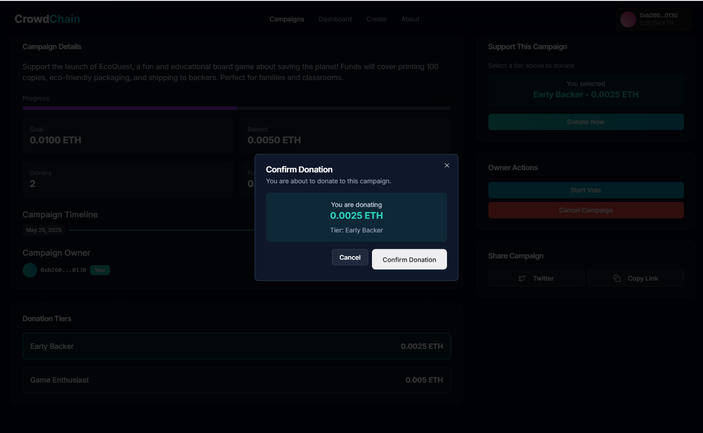
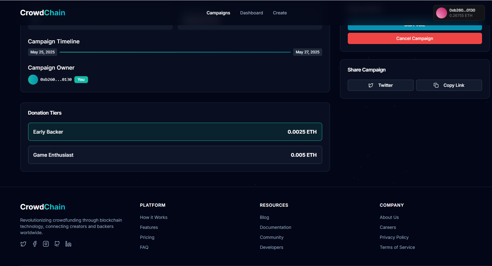
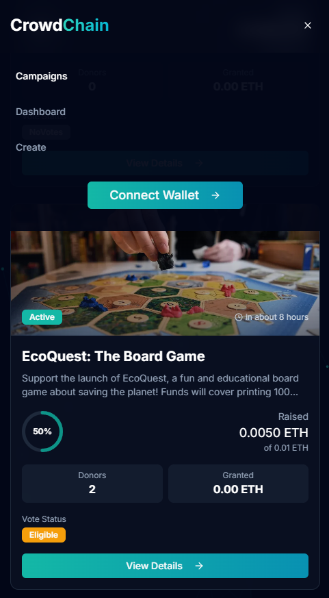

# CrowdChain – Decentralized Crowdfunding Platform

CrowdChain is a decentralized crowdfunding platform built with Next.js, Thirdweb, and Solidity. It enables campaign creators to raise funds transparently, while ensuring that contributors retain control over how funds are released through on-chain community voting.

This project is deployed on the Sepolia Ethereum Testnet and requires a Web3 wallet like MetaMask and some test ETH to interact.

---

## Features

### Campaign Creation
- Any wallet-connected user can start a crowdfunding campaign.
- Each campaign includes title, description, funding goal, deadline, image, and funding tiers.


### Secure Donations
- Contributors can donate ETH via a secure wallet flow.
- Donations are recorded on-chain for full transparency.



### Tiered Support Levels
- Campaigns can define multiple funding tiers with names and minimum ETH amounts.



### Community Voting for Fund Releases
- Campaign owners must create a vote to request fund withdrawals.
- Donors vote "Yes" or "No" using their wallet.
- Funds are released only if the vote passes.


### Transparent Campaign Data
- Public display of:
  - Total raised funds
  - Donor count
  - Funding Raised
  - Funds Allocated
- Countdown timers for votes and campaign deadlines.


### Responsive Interface
- Fully responsive design built with Tailwind CSS and ShadCN UI.
- Clean layout optimized for both desktop and mobile devices.

<div style="text-align: center;">
  
  
</div>

---

## Wallet Requirement

To use the platform, a Web3 wallet such as MetaMask is required. It is used for:

- Creating or funding campaigns
- Voting on fund release proposals
- Withdrawing funds (for campaign owners)

MetaMask can be downloaded at [https://metamask.io](https://metamask.io).

---

## Sepolia Testnet Requirement

CrowdChain runs on the Sepolia Ethereum Testnet. You will need test ETH in your wallet to interact with the application.

Get Sepolia test ETH from the official faucet:
[https://cloud.google.com/application/web3/faucet/ethereum/sepolia](https://cloud.google.com/application/web3/faucet/ethereum/sepolia)

Make sure your MetaMask is connected to the Sepolia network before using the app.

---

## Local Development

To run the project locally:

1. Clone the repository:
   ```bash
   git clone https://github.com/Abhinav-Singh10/CrowdChain.git
   cd CrowdChain
  
2. Install dependencies:
      ```bash
      pnpm install
3. Log in to https://thirdweb.com and create a project to obtain your clientId.
4. Copy .envexample to .env and fill in the required environment variables:
    ```bash
    cp .envexample .env
  Inside ***.env***, replace:

    NEXT_PUBLIC_THIRDWEB_CLIENT_ID=your_client_id_here
5. Start the development server:

    ```bash
    pnpm dev
6. Open http://localhost:3000 in your browser and connect your wallet.

